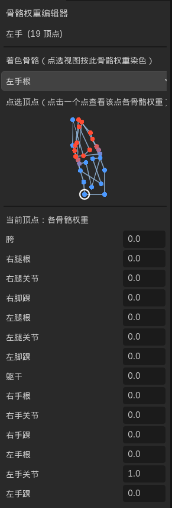

# 骨骼权重编辑器 (Bone Weight Editor)

Godot 4.x 编辑器插件：为 `Polygon2D`（2D 蒙皮网格）提供**逐顶点、逐骨骼**的权重查看与设置。

> 精简版：只保留两块 —— 面板内"点选顶点"预览 + "当前顶点：各骨骼权重"设置。

## 演示



## 安装 / 在项目里启用

插件必须放在目标项目的 `res://addons/` 下并启用才会加载。

1. 把本文件夹（`addons/bone_weight_editor`）整体复制到目标项目根目录的 `addons/` 下。
2. 启用插件（二选一）：
   - 编辑器界面：**Project → Project Settings → 插件 / Plugins** → 勾选 **骨骼权重编辑器 (Bone Weight Editor)**。
   - 或在该项目的 `project.godot` 里加：
     ```
     [editor_plugins]

     enabled=PackedStringArray("res://addons/bone_weight_editor/plugin.cfg")
     ```
3. 重新打开该项目，在场景里选中一个 `Polygon2D`，右侧 Dock 出现"骨骼权重编辑器"面板。

> 注意：
> - **文件夹名请保留为 `bone_weight_editor`**（`bone_weight_editor.gd` 内写死了
>   `preload("res://addons/bone_weight_editor/weight_panel.tscn")`，改名需同步改这一行）。
> - 插件对项目本身没有其它要求，只要目标项目里有 `Polygon2D` + `Skeleton2D` 且骨骼已绑定
>   （Sync Bones / `add_bone()`）即可使用。

## 特性

- **选中即编辑**：在场景中选中任意 `Polygon2D` 部件，右侧 Dock 自动出现"骨骼权重编辑器"面板。
- **点选顶点（面板内）**：面板里有一个点选预览视图，绘制该 Polygon2D 的轮廓与顶点，
  **点击任意一个点**即可选中该顶点；顶点按当前"着色骨骼"的权重染色（红 = 1.0，蓝 = 0.0），
  选中的点带白色高亮圈。
- **当前顶点：各骨骼权重**：列出**所有骨骼**（如 胯/根/关节/踝），每根骨骼一个数值框，
  直接输入 0.00 ~ 1.00 即可设置该点在该骨骼上的权重。
- **撤销/重做**：每次修改走 UndoRedo（Ctrl+Z / Ctrl+Y）。

## 用法

1. 确保 `Polygon2D` 已绑定骨架并"Sync Bones to Polygon"（或用 `add_bone()` 添加过骨骼）。
2. 在面板顶部的"着色骨骼"选一根骨骼，点选预览按该骨骼权重上色。
3. 在点选预览里**点击一个点**，下方"当前顶点：各骨骼权重"列出该点所有骨骼的当前权重。
4. 直接改某根骨骼的数值框即可设置该点在该骨骼上所占的权重。
5. 保存场景（Ctrl+S）写入持久化。

## 数据说明

- `Polygon2D` 的骨骼权重按骨骼存储，每根骨骼一个 `PackedFloat32Array`
  （长度 = `internal_vertex_count`，为 0 时按 `polygon.size()` 计）。
- 全部通过官方 API 读写：`get_bone_count()` / `get_bone_path(i)` /
  `get_bone_weights(i)` / `set_bone_weights(i, weights)`。
